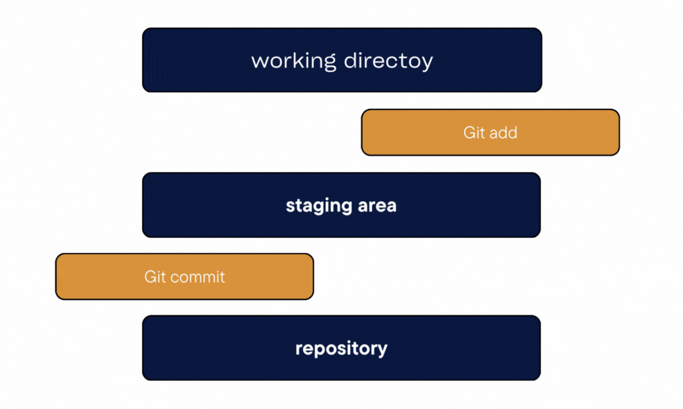
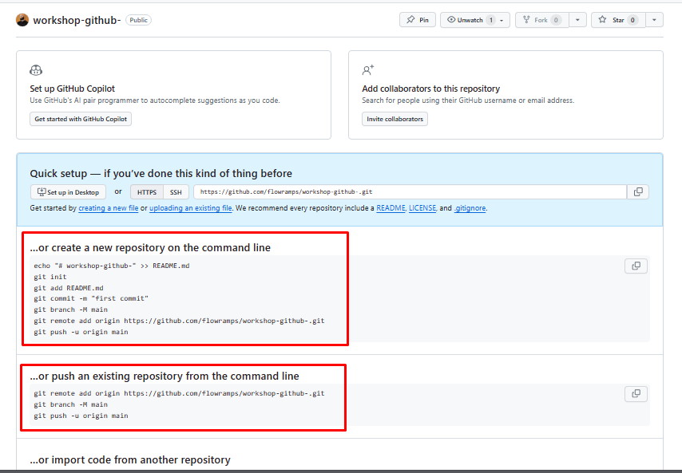

# Flow Git e Github na prática
sejam bem vindos a mais um flow de aprendizado, eu sou a Rafael Rampasso e hoje eu vou mostrar pra vocês como utilizar o GIT na prática

## Instalando o GIT

* [Link com os downloads](https://git-scm.com/downloads)

## Criar um projeto novo

* Criar uma nova pasta em seu computador, com o nome `Flow Git`

* Abrir o VSCode nessa pasta

* Criar um novo arquivo `README.md`

* Escrever dentro dele `Você aprenderá alguns comandos do Git`

* Salva o arquivo

Agora então é hora de usarmos o Git

* Abre o Git Bash que foi instalado na máquina (pode ser pelo terminal do VSCode mesmo)

* `git init` para inicializar o repositório

Foi criada uma pasta `.git` e é ali que toda a mágica acontece, então não apague

* `git add README.md` para colocar o arquivo na área de stagging 


Esse `add` é necessário antes de darmos o commit.

* `git commit -m "primeiro commit"` dar o commit no repositório.

* `git branch -M "main"` para alterar o nome da branch principal de `master` para `main` (isso é uma boa prática atualmente recomendada)

## Interfaces Git

Beleza, recebemos a confirmação de que o commit aconteceu, mas isso tá um pouco abstrato ainda né?
Existem algumas [interfaces legais do git](https://git-scm.com/downloads/guis) que você pode fazer o download para poder visualizar como está o projeto, o que foi alterado em cada commit, quando foi alterado etc.
Aqui eu vou mostrar pra vocês a usarem direto no Github.

## Repositório no Github

* Depois de você ter criado a sua conta na plataforma, você irá em `Criar novo repositório`

Você vai preencher com as informações do projeto, então dar o nome do repositório, colocar uma breve descrição e criar


Logo depois vai aparecer essa página um pouco cinza e confusa e com vários comandos (pode até perceber que alguns deles já usamos), mas o que você tem que fazer é bem simples, apenas copie o link que aparecer para você



* Para passar o commit do meu repositório local (da minha máquina) para um repositório na plataforma do Github, usamos o `git remote add origin <link do repositório>`

* `origin` é o nome utilizado para referenciar o nosso repositório

Agora já temos o nosso repositório local conectado com o respositório do Github, porém o `commit` que damos na máquina não sobe automaticamente para a plataforma

* Para isso precisaremos empurrar, enviar para lá com o `git push -u origin main`

Agora se recarregarmos a página iremos ver o nosso arquivo aqui na plataforma!

## Alterando e adicionando arquivo

Beleza, agora que temos o nosso repositório no Github configurado direitinho, podemos usar e abusar do que o Git oferece, afinal é pra isso que estamos utilizando ele né?
Primeira coisa que faremos então é alterar esse arquivo que já commitamos

* Adiciona mais uma frase no arquivo `Essa é uma alteração`

* Além disso iremos criar um novo arquivo `Projeto.md`, onde escreveremos `Esse é o arquivo onde desenvolverei o meu projeto`

* Agora então precisamos subir essa alteração, pra isso seguiremos os mesmos passos de `git add .` (agora ponto `.` pois adiciona todos os arquivos) e `git commit -m "Primeira alteração"`

* Lembrando que para alterar algo no nosso respositório do Github precisamos dar o push, então `git push origin main` (sem o -u)

Se olharmos agora o nosso código no Github, ele terá sido alterado, e não só isso, se clicarmos no nome do `commit`, podemos ver exatamente as alterações que foram feitas nele.
O verde com `+` e o vermelho com `-` mostra, os conteúdos que foram adicionados e editados dentro do código.
Aqui nesse botão poderemos ver todos os commits já feitos anteriormente, então se clicarmos em algum deles, veremos exatamente o que havia sido alterado, além de claro, vermos o código como era. Incrível né?

## Configurações Globais

# Configurar o editor padrão e a branch inicial
```
git config --global core.editor vim
git config --global init.defaultBranch main
```
# Visualizar as configurações globais
```
cat ~/.gitconfig
```
# Configurar o editor do sistema para uso global com o Vim
```
git config --system core.editor vim
```
## Inicialização de Repositório

# Inicializar um repositório Git
```
git init
```
## Gerenciamento de Arquivos

# Adicionar um arquivo para ser rastreado
```
git add arquivo.txt
```
# Desfazer a adição de um arquivo
```
git reset
```
# Efetuar um commit
```
git commit
```
## Gerenciamento de Commits

# Adicionar e commitar alterações de forma rápida
```
git commit -a -m "Commit rápido para arquivo.txt"
```
# Visualizar o histórico de commits
```
git log
```
# Visualizar o histórico de um arquivo específico
```
git log -p arquivo.txt
```
# Reverter para um commit específico
```
git checkout 2cc62bbe0f7fcfb4483df968fb169dc85e01cfa4
```
# Reverter para a branch principal
```
git checkout main
```
# Desfazer o último commit sem perder alterações
```
git reset --soft HEAD~1
```
# Desfazer o último commit e descartar alterações
```
git reset --hard
```
## Ignorando Arquivos

# Utilize o arquivo .gitignore para especificar quais arquivos não devem ser incluídos no repositório.

## Gerenciamento de Branches

# Criar uma nova branch
```
git branch feature/novo_arquivo
```
# Mudar para uma branch específica
```
git checkout feature/novo_arquivo
```
# Mudar o nome da branch atual
```
git branch -m novo_nome
```
# Deletar uma branch
```
git branch -D nome_da_branch
```
## Merge

# Criar uma nova branch e efetuar o merge
```
git checkout -b stg
git checkout main
git merge stg
```
# Deletar uma branch após o merge
```
git branch -d stg
```
## Rebase

# Atenção: O uso de rebase pode reescrever o histórico, use com cuidado.
```
git rebase stg
```
## Cherry Pick

# Selecionar commits específicos de uma branch e aplicá-los em outra
```
git log
git cherry-pick 5801dac2c67519a4041666421149877c39439a20
```
## Git Tag

# Listar todas as tags
```
git tag
```
# Criar uma tag
```
git tag -a v2.0 -m "Versão 2.0"
```
# Adicionar uma tag a um commit específico
```
git tag -a v1.0 -m "Versão 1.0" 5801dac2c67519a4041666421149877c39439a20
```
# Visualizar detalhes de uma tag
```
git show v2.0
```
# Deletar uma tag
```
git tag -d v2.0
```
## Trabalhando com repositório remoto

# Criar e commitar em uma nova branch
```
git checkout -b branchnova
git add .
git commit -m "Aletração em arquivo main.txt (teste remoto)"
```
# Realizar o merge na branch principal e fazer o push
```
git branch main
git checkout main
git merge branchnova
git push
```
## Lidando com conflito

# Realizar fetch e validar/listar branches existentes
```
git fetch origin
git branch -r
```
# Realizar checkout na branch remota e validar diferenças
```
git checkout origin/main
git diff main origin/main
```
# Realizar merge após ajustes e commit
```
git checkout main
git merge origin main
git commit -a -m "Merge commit fetch"
git push
```
## Git Log

# Diversas opções de visualização do histórico
```
git log --oneline
git log
git log --stat
git log --n
git log --graph --oneline
git log --author="msrampasso"
git log --after="1 week ago"
```
## Publicação

# Adicionar, commitar e fazer push para a branch master
```
git add .
git commit -m "Script para validação cn - azure e ops"
git push origin master
```
Espero que este guia seja útil para entender e utilizar o Git de forma eficiente. Sinta-se à vontade para personalizar conforme necessário.

